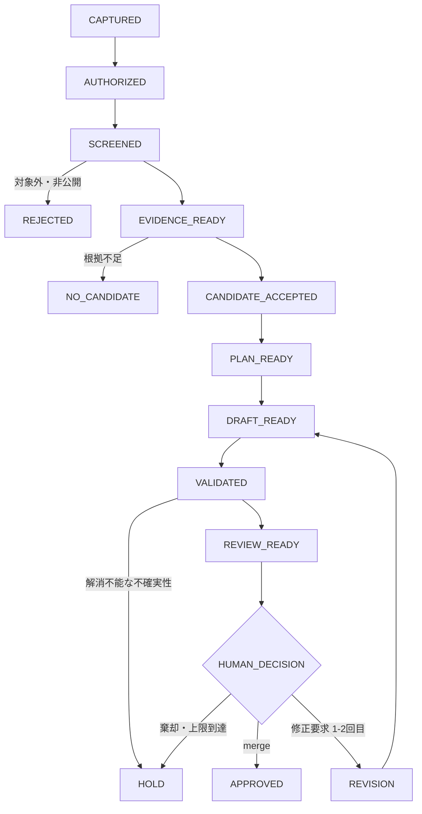

# Knowledge Harness Pipeline

## 目的

記事候補の受付から公開判断までを、再開可能で監査可能な小さなOperationへ分解する。通常経路では、人間への質問なしに公開候補の作成または安全な終了まで進める。

この文書は実装仕様ではなく、Operation間の契約を定める。ファイル形式、CLI、GitHub Actionsなどの実装詳細は、各Operationを実装するときに決める。

## 設計原則

- 一つのOperationは、一つの主目的と一つの状態遷移だけを持つ
- 同じ入力に対して同じ結果を返せる処理はProgramへ割り当て、冪等にする
- 手順と評価基準を固定できる文章処理はSkill / Agentへ割り当てる
- 規則だけでは判定できない意味判断はAI Judgeへ割り当て、根拠と確信度を残す
- 根拠不足、新規性不足、品質不足は人間への質問ではなく、安全な非公開終了を既定とする
- 初期要件では、利用者が明示した知りたい情報と承認済み実行ラベルに基づく探索のみを扱う
- 探索は定義済みの上限（検索ラウンド数、取得件数、処理時間、再試行回数）内で実行し、入力や実行ラベルに含まれない新規テーマを自動追加しない
- 上限値と停止条件の具体値は、O-04 `Collect Evidence`の契約を正本とする
- 週次ジョブは後続の運用目標として扱い、安定した一件単位の公開候補生成と再開可能性を確立してから導入する
- 人間は公開可能性、恒久方針の変更、例外、最終公開承認だけを判断する
- 人間が応答しなくても、公開以外の許可済み処理は継続できるようにする

## Git運用モード

- 通常の実装・文書修正は、feature branchでコミット＆プッシュを基本とする
- PRは必須にしない。レビュー負荷より記録性を優先したい場合は、Issueとコミット履歴を正本として扱う
- 次の変更はPRを使う: 公開影響が大きい変更、破壊的変更、CI/デプロイ/権限など運用基盤の変更
- 作業再開は最小確認を既定とし、`docs/agents/resume-minimal-checklist.md`の手順とプロンプトを使う
- セッション終了時は`_notes/sessions/resume-handoff-latest.md`を更新し、次回再開の入力を固定する

## 状態遷移

`REJECTED`、`NO_CANDIDATE`、`HOLD`は、いずれも記事を公開しない正常終了である。`APPROVED`だけが公開を許可する。

## 共通Operation契約

すべてのOperationは、最低限次の情報を受け渡す。

- `run_id`: 一連の処理を識別するID
- `input_refs`: 入力成果物と出典への参照
- `state_before`: 実行前の状態
- `state_after`: 実行後の状態
- `result`: `ADVANCE`、`NO_CANDIDATE`、`REJECTED`、`HOLD`、`RETRYABLE_ERROR`のいずれか
- `reason_codes`: 機械判定可能な理由コード
- `summary_ja`: 運用者が読める日本語の要約
- `uncertainties`: 未確認事項と記事への影響
- `created_at`: 情報基準時刻
- `producer`: Program、Skill / Agent、AI Judge、人間の区別

入力を変更しない再実行では、成果物を重複生成せず、同じ`run_id`の状態を更新する。

## Operation一覧

| ID | Operation | 主担当 | 入力 | 出力 | 人間を呼ぶ条件 |
|---|---|---|---|---|---|
| O-01 | Capture Request | Program | 公開Issueまたは許可済み入力 | Request | 公開可能性が明示されていない |
| O-02 | Authorize Run | Program | Request、実行ラベル | Authorized Request | 呼ばない。ラベルがなければ待機 |
| O-03 | Screen Safety | Program | Authorized Request | Screening Result | 私的情報か判断不能な場合だけ |
| O-04 | Collect Evidence | Program | Screening Result、対象範囲 | Evidence Set | 呼ばない。欠落・矛盾を記録し、全面的な取得不能だけHOLD |
| O-05 | Build Evidence Packet | Skill / Agent | Evidence Set | Evidence Packet | 呼ばない。不足は明示する |
| O-06 | Judge Candidate | AI Judge | Evidence Packet、過去記事 | Candidate Decision | 呼ばない。不足・新規性なしはNO_CANDIDATE |
| O-07 | Plan Article | Skill / Agent | Accepted Candidate | Article Plan | 著者固有の動機が中心主張に必須で、根拠から復元不能な場合だけ |
| O-08 | Draft Article | Skill / Agent | Article Plan、Evidence Packet | Draft | 呼ばない |
| O-09 | Validate Draft | Program + AI Judge | Draft、Evidence Packet、公開規則 | Validation Report | 新しい恒久方針が必要な場合だけ |
| O-10 | Prepare Review | Program / Agent | Validated Draft | Draft PR、Review Packet | 呼ばない |
| O-11 | Decide Publication | 人間 | Draft PR、Review Packet | merge、修正要求、棄却 | 常に一回。最終公開判断のみ |
| O-12 | Apply Feedback | Skill / Agent | 修正要求、Draft | Revised Draft | 2回を超える修正が必要な場合だけHOLD |
| O-13 | Record Outcome | Program | 終了状態、成果物 | Status、HANDOFF、Metrics | 方針変更候補だけ別途提示 |

## 各Operationの成功条件

### O-01 Capture Request

- 「知りたいこと」が一文以上ある
- 公開Issueへ置いてよい情報であることが確認されている
- Issue作成だけでは後続処理を開始しない

不足がある場合は、公開可能性だけを人間へ確認する。記事の構成や技術的結論は質問しない。

### O-02 Authorize Run

- 明示的な実行ラベルが存在する場合だけ`AUTHORIZED`へ進む
- ラベルがなければ状態を変えず、質問や催促を行わない

### O-03 Screen Safety

- 秘密情報、個人情報、会社情報、非公開会話を検出する
- 明確に対象外なら`REJECTED`で終了する
- マスクで安全に処理できる場合は、マスク後の参照だけを後段へ渡す
- 公開可否を機械的に確定できない場合だけ人間へ確認する

### O-04 Collect Evidence

- 公式・一次情報を優先し、一般Web上の説明、評価、懸念も候補に含める
- 情報源を`primary`、`secondary`、`community`、`discovery_only`へ分類し、多数意見を事実の正しさとして扱わない
- 出典URLまたはリポジトリ参照、タイトル、発行者・著者、発行日、取得時刻、対象バージョン、該当箇所、日本語要約、確からしさと理由を保存する
- 検索結果のスニペットは発見専用とし、可能な限りリンク先を取得する
- 同一出典を重複登録せず、同一ドメインへの偏りを抑える
- 初期値として、検索3ラウンド、各ラウンド4クエリ、本文取得20件、採用12件、同一ドメイン3件、処理時間15分を上限とする
- 一時的な取得失敗は1 URLにつき追加2回まで再試行する
- 核心事実は一次・公式情報2件を目標とし、世間的評価を扱う場合は独立した二次・コミュニティ情報3件を目標とする。ただし、存在しない資料を件数合わせで補わない
- 必要な論点を確認できた場合、検索結果が重複だけになった場合、または上限へ達した場合に収集を終了する
- 根拠不足、取得不能、矛盾、対象範囲の曖昧さ、古さを理由コードと不確実性として消さずに保存する
- 何らかの証拠が得られた場合は、不足や矛盾があっても`EVIDENCE_READY / ADVANCE`として後続へ渡す
- 全面的な取得不能だけを`HOLD`とし、一時的な取得失敗は`RETRYABLE_ERROR`と区別する
- 検索数、取得試行数、成功率、採用数、一次情報率、重複数、取得不能数、矛盾数、不足論点数、処理時間をMetricsとして記録する
- 初期上限は固定的な正解とせず、原則10実行分のMetricsと後続Operationで判明した根拠不足から変更候補を作る。恒久変更は自動採用しない

### O-05 Build Evidence Packet

- O-04の`EVIDENCE_READY / ADVANCE` Evidence Setだけを入力として受け付ける
- 論点単位で、事実、推測、未確認事項、世間的反応、矛盾を分離する
- Packet内の各記述へ、Evidence Setに実在する一件以上の`source_id`を付ける
- 一次情報が示す事実と、二次・コミュニティ情報が示す説明や評価を混同しない
- 取得不能、対象範囲の曖昧さ、古さ、矛盾を不確実性として引き継ぐ
- 過去記事参照がある場合は、既知事項、差分候補、再確認が必要な事項を分ける
- 過去記事参照がない場合は、差分を推測せず未確認とする
- PDFは権威として扱わず、運用者本人の疑問や判断の記録媒体として扱う
- 根拠のない補完、矛盾の黙示的な解消、記事候補の採否判断を行わない
- 根拠充足性、新規性、読者価値、新しく記事にする理由の成立可否はO-06へ委ねる

### O-06 Judge Candidate

AI Judgeは次を独立に評価し、`PASS`、`FAIL`、`UNCERTAIN`、0から1の確信度、理由、参照したEvidence Packet項目を残す。

- 根拠充足性
- 過去記事からの新規性
- 外部読者が再利用できる価値
- 著者固有の問いまたは判断の存在
- 不確実性が核心主張へ与える影響

- 根拠充足性、新規性、外部読者価値、著者固有の問いまたは判断を必須軸とする
- 不確実性の影響は`LOW`、`MEDIUM`、`HIGH`で記録する
- 必須軸のいずれかが`FAIL`なら`NO_CANDIDATE / NO_CANDIDATE`とする
- `FAIL`はないが必須軸に`UNCERTAIN`がある、確信度0.70未満の`PASS`がある、または未解決不確実性の影響が`HIGH`なら`HOLD / HOLD`とする
- すべての必須軸が確信度0.70以上の`PASS`で、不確実性の影響が`LOW`または`MEDIUM`の場合だけ`CANDIDATE_ACCEPTED / ADVANCE`とする
- 根拠充足性の`PASS`は一次情報の件数だけで決めず、候補となる中心的な論点をPacketの出典が支えているかで判断する
- 新規性の`PASS`は過去記事との差分が確認できる場合に限り、過去記事参照がなければ`UNCERTAIN`とする
- 外部読者価値は再現可能性、転用可能性、検索動機の存在を理由付きで評価する
- 著者固有の問いまたは判断はScreened RequestとPacketから復元できる場合に限り`PASS`とする
- 人間へ追加調査や技術的事実の推測を依頼せず、記事数を増やす目的で閾値を下げない

### O-07 Plan Article

- O-06の`CANDIDATE_ACCEPTED / ADVANCE`と同じ`run_id`のEvidence Packetだけを入力する
- 仮題と、記事全体で伝える中心メッセージ一文を決める
- 対象読者、検索動機、構成型、含めない内容と理由を決める
- 構成型は`TUTORIAL`、`CONCEPT_EXPLANATION`、`CHANGE_ANALYSIS`、`TROUBLESHOOTING`、`DECISION_RECORD`から選ぶ
- 各節に一意なID、見出し、目的、読者が得るもの、実在するEvidence Packet項目を対応付ける
- ログ順ではなく読者に伝わる順序へ組み替える
- 不確実性ごとに`DISCLOSE`、`LIMIT_CLAIM`、`EXCLUDE`の扱いと理由を記録する
- Packetにない事実を追加せず、O-06の候補採否を再判定しない
- 通常は`PLAN_READY / ADVANCE`とし、O-08がPlan外の主張を追加できない契約を作る
- 人間への質問は、著者固有の動機が中心メッセージに不可欠で、Screened RequestとPacketから復元できない場合だけ一回、最大3問までとする
- 質問は公開可能な著者の意図だけに限定し、技術的事実、根拠不足、構成の好みを補うために使わない
- 質問が必要な場合は`HOLD / HOLD`とし、回答がなければ本文生成へ進まない
- 回答がなくても安全に計画できる場合は、不確実性を残して続行する

### O-08 Draft Article

- O-07の`PLAN_READY / ADVANCE`と同じ`run_id`のEvidence Packetだけを入力する
- Skill / AgentはArticle Planの節ごとに、一意なブロックID、reStructuredText本文、使用するPacket参照を持つ本文案を作る
- ProgramはPlanの全節が同じIDと順序で一回ずつ存在し、本文参照がその節で許可されたPacket参照の範囲内であることを検証する
- 各節の計画済みPacket参照を少なくとも一つの本文ブロックへ対応付ける
- `DISCLOSE`と`LIMIT_CLAIM`の不確実性を本文へ反映し、`EXCLUDE`対象を本文参照へ含めない
- `raw`、`include`、`literalinclude`など外部内容を取り込むreStructuredText directiveを拒否する
- 仮題を用いた日本語reStructuredTextとして`draft.rst`を生成し、全ブロックのPlan節とPacket参照を`draft_manifest.json`へ保存する
- 公開日、情報基準日、対象バージョン、記事状態を区別し、確認できない値は推測せず`未確認`または`未確定`とする
- AIの担当範囲と人間の確認範囲を記事の早い位置に明示する
- 公開用`post` directiveと最終公開日は生成せず、`docs/blog/posts/`へ配置しない
- 原文、根拠、Article Planにない事実、節、著者意図を追加しない
- 事実性、意味の飛躍、読者価値、構成品質、リンク、ビルド、秘密情報はO-09で検証する
- 人間へ質問せず`DRAFT_READY / ADVANCE`とする

### O-09 Validate Draft

Programはmanifest整合性、reStructuredText構文、メタデータ、リンク、重複、安全性を検査し、AI Judgeは次の5軸を独立に評価する。

- 事実的主張がPacket根拠で支えられているか
- 根拠から中心メッセージへの意味の飛躍がないか
- 対象読者が再利用できる価値を維持しているか
- Article Planの中心メッセージ、節順、除外事項に整合しているか
- 不確実性をPlanどおり明示・限定・除外しているか

各AI評価は`PASS`、`FAIL`、`UNCERTAIN`、0から1の確信度、理由、実在するDraftブロックとPacket項目の参照を残す。

- Draft SHA-256、全ブロック、節、Packet参照をmanifestと照合する
- reStructuredTextを単独で構文解析し、構文エラーを記録する
- 外部URLはEvidence Packetの情報源URLだけを許可し、O-09で新しい取得を行わない
- ローカル参照はリポジトリ内に限定し、パストラバーサルと不存在をエラーにする
- 正規化タイトルが既存記事と一致する場合はエラー、本文類似度0.85以上はAI Judgeへ渡す重複候補とする
- O-03相当の秘密情報、非公開マーカー、マスクされていないメールアドレス・電話番号をエラーにする
- 末尾空白、最終改行、Program生成見出しの装飾長だけを一回自動修正して再検査する
- 本文の意味、事実、主張、構成、リンク先を自動修正しない
- Programエラーがなく、全必須軸が確信度0.70以上の`PASS`の場合だけ`VALIDATED / ADVANCE`とする
- 未解決Programエラー、必須軸の`FAIL`または`UNCERTAIN`、確信度0.70未満は`HOLD / HOLD`とする
- 核心主張の根拠不足は`HOLD`とし、人間へ技術的事実を質問しない
- 新しい恒久方針が本当に必要な場合だけ、現行方針を維持したまま選択肢と影響を持つ候補を記録する
- 単発記事の表現調整を恒久方針の質問にしない

### O-10 Prepare Review

- 同じ`run_id`の`VALIDATED / ADVANCE`、修正済みDraft、Article Plan、Evidence Packetだけを受け付ける
- Skill / Agentが最終タイトル、slug、公開日、ablog metadata、PR説明案を作り、Programが形式と入力整合を検証する
- 公開日はAsia/Tokyo基準で実行日より後の未使用日とし、既存記事とファイル名・日付が重複しない最初の日を選ぶ
- 公開候補を`docs/blog/posts/YYYY-MM-DD-slug.rst`へ置き、`post` directiveの`language`を`ja`とする
- O-09の修正済みDraft本文を意味変更せず、公開用metadataの付与とDraft表示の置換だけを行う
- Review Packetに中心メッセージ、主要根拠、不確実性、検証結果、AI担当範囲、人間の確認範囲、変更ファイルを日本語でまとめる
- 人間向けには「公開候補の確認待ち」と表示し、merge、今回だけの修正要求、棄却、恒久方針候補の4選択肢と影響を日本語で示す
- 無回答時は公開せず`HOLD`を維持することをReview PacketとPR本文へ明記する
- 公開候補と入力成果物のSHA-256、`run_id`、参照先をReview Packetへ保存する
- 一実行につき一つのbranchとDraft PRだけを準備し、再実行で重複PRを作らない
- O-10はmerge、公開承認、レビューコメントの解釈、本文修正、英訳、画像生成を行わない
- 正常時は`REVIEW_READY / ADVANCE`としてO-11へ渡す
- O-09以前で公開候補なしまたは`HOLD`の場合はO-10を実行せず、PRを作らずO-13へ進む

### O-11 Decide Publication

- 同じ`run_id`の`REVIEW_READY / ADVANCE`、Review Packet、公開候補、対象Draft PRだけを受け付ける
- PRのrepository、番号、base、head、公開候補commitとSHA-256をReview Packetの準備情報へ照合する
- 人間には次の4選択肢を日本語で示し、内部コードを選ばせない
  - 「公開を承認する」: 対象PRのmerge事実を確認し、`APPROVED / ADVANCE`とする
  - 「今回だけ修正を求める」: 具体的な日本語指示、対象箇所、GitHubコメント参照を保存し、`REVISION / ADVANCE`とする
  - 「公開しない」: 理由を保存し、`HOLD / HOLD`としてO-13へ渡す
  - 「今後の方針として検討する」: 問題、2〜3選択肢、影響を候補として保存し、公開せず`HOLD / HOLD`とする
- mergeはGitHub上の対象PRの事実を正本とし、merge以外は許可された人間の構造化判断一件を正本とする
- 判断者、判断日時、PR URL、comment・review ID、対象commit SHAを保存する
- 自由文だけから判断種別を推測せず、指定がないコメントは今回だけの修正候補としても自動採用しない
- 無回答、複数・矛盾する判断、対象外actor、対象PRやSHAの不整合は公開せず`HOLD / HOLD`とする
- 人間向けに「公開を承認しました」「修正後に再確認します」「公開しません」「方針判断のため保留します」を日本語表示する
- 同一判断の再実行ではPublication Decisionと履歴を重複生成しない
- O-11はGitHub操作、修正反映、再検証、恒久方針の採用、公開後確認を行わない

### O-12 Apply Feedback

- 同じ`run_id`の`REVISION / ADVANCE`、Publication Decision、対象公開候補、Review Packet、上流Draftだけを受け付ける
- 具体的な日本語修正指示、対象箇所、GitHub参照、対象commit、修正前SHA-256を照合する
- 修正文案は指定対象だけへ適用し、未指定ブロック、Article Planの節構成、中心メッセージを変更しない
- 変更ブロックごとに修正要求、既存Packet参照、修正前後SHA-256をrevision manifestへ保存する
- 新しい根拠、未依頼の節・主張、対象不明の指示、上流成果物の変更を拒否して`HOLD / HOLD`とする
- AIによる修正は同一記事2回までとし、3回目は実行せず`HOLD / HOLD`とする
- 正常時は`REVISED / ADVANCE`と日本語の「修正しました。再検証します」を保存し、O-09へ戻す
- 修正後も公開承認済みとは扱わず、O-09、O-10、O-11の検証・レビューを再実行する
- 同一入力の再実行ではRevised Draft、差分、履歴を重複生成しない
- O-12は新しい調査、根拠補完、公開候補への再配置、GitHub操作、恒久方針採用を行わない

### O-13 Record Outcome

- 終了状態、理由コード、成果物、検証結果、次の一手を記録する
- 公開候補なしの場合は人間を呼ばない
- 反復して発生する人間判断を改善候補として集計する
- 方針変更は自動採用せず、候補として`DECISIONS.md`に提案する

## 人間判断の予算

通常の一実行で、パイプラインから人間を呼ぶ回数は最終公開判断の一回を上限とする。実行ラベルの付与は人間が開始前に与えるトリガーであり、この判断予算には含めない。次の例外は上限外だが、同じ理由で繰り返し質問しない。

| 判断 | 既定動作 | 人間へ確認する条件 |
|---|---|---|
| 実行開始 | 待機 | 人間が実行ラベルを付ける。催促しない |
| 公開可能性 | REJECTEDまたは待機 | 入力時に明示がなく、自動判定不能 |
| 根拠不足 | NO_CANDIDATEまたはHOLD | 確認しない |
| 新規性不足 | NO_CANDIDATE | 確認しない |
| 技術的不確実性 | HOLD | 人間に技術的事実を推測させない |
| 著者の動機不足 | 不確実性を明示して続行 | 中心メッセージが成立しない場合だけ一回 |
| 単発の文章修正 | AIで修正 | Draft PRへの修正要求だけを受け付ける |
| 恒久方針の変更 | 現行方針を維持 | 選択肢と影響を提示して確認 |
| 最終公開 | HOLD | 必ず人間がmergeまたは棄却を判断 |

## 代表シナリオ

### 通常公開

`CAPTURED`から`REVIEW_READY`まで人間への質問なしで進む。人間がDraft PRを一回確認してmergeし、O-13が結果を記録する。

### 公開候補なし

O-06が新規性または読者価値不足を理由に`NO_CANDIDATE`とする。PRを作らずO-13が結果を記録し、人間を呼ばない。

### 情報不足

O-04は取得できた証拠、取得不能、矛盾、不足をEvidence Setへ残す。O-05とO-06の評価後も核心主張を支えられない場合は`NO_CANDIDATE`または`HOLD`で終了する。人間へ追加調査を依頼せず、取得不能な根拠と再開条件を記録する。

### 修正上限到達

二回のAI修正後も検証を通らない場合、`HOLD`で終了する。同じ記事について追加の修正判断を人間へ求めず、問題と再開条件を記録する。

## Phase 1後の最初の実装候補

最初の実装候補はO-13 `Record Outcome`とする。理由は、他のOperationを実装する前から成功、非公開終了、失敗、再開条件を同じ形式で残せるためである。

Phase 1の完了時に、この候補を最初の一件として採用するか確認する。採用前に実装へ着手しない。

## Phase 15: 横断統合の実装境界

### 目的

個別Operation（O-01〜O-13）を安全に連結し、`run_id`単位で再開可能な一連実行を定義する。

### スコープ

- `CAPTURED`から`APPROVED`、`NO_CANDIDATE`、`HOLD`までの遷移を、Operation契約に従って順に実行するOrchestrator境界を定義する
- 各Operationの入力成果物、`state_before`、`state_after`、`result`を照合し、前段不整合時は次段へ進めない停止条件を定義する
- `RETRYABLE_ERROR`、`HOLD`、`NO_CANDIDATE`、`REJECTED`の終了条件と、再実行時の再開位置を定義する
- O-09からO-12への再検証ループを含む再遷移条件を定義する
- 横断統合で集計する最低限の実行記録（実行順、所要時間、停止理由、再開条件）を定義する

### スコープ外

- O-01〜O-13各Operationの判定規則、入出力形式、閾値の変更
- GitHub Actions、定期実行、外部サービス連携の実装
- 記事本文、翻訳、画像、公開導線のUI改善
- 恒久方針候補の自動採用

### 完了条件

- 横断統合の実行順と停止条件を文書として一意に定義する
- 再開時に必要な最小入力（`run_id`、現在状態、必須成果物）を定義する
- 再実行で重複生成しない冪等境界を定義する
- 例外系（不整合、欠落、再試行上限）を`HOLD`または`RETRYABLE_ERROR`へ正規化する規則を定義する
- 最初の実装候補を一件に絞って`STATUS.md`へ記録する

### 最初の実装候補（Phase 15-a）

最初の実装候補は、統合Orchestratorの最小経路としてO-01〜O-03の直列実行だけを扱う。

- 実行順: O-01 `Capture Request` → O-02 `Authorize Run` → O-03 `Screen Safety`
- 入力: 公開可能なRequest入力、必須実行ラベル、`run_id`
- 正常終了: O-03が`SCREENED / ADVANCE`を返した時点で終了し、次段（O-04以降）は呼ばない
- 停止条件: 前段不整合、成果物欠落、契約違反、`HOLD`、`REJECTED`、`RETRYABLE_ERROR`
- 再開条件: 同じ`run_id`で未完了段から再実行し、完了済み段の成果物は再生成しない
- 監査記録: 実行段、停止理由、再開位置、入力参照をO-13互換の形式で残す

この候補で横断統合の最小要件（実行順、停止、再開、冪等）を先に検証し、O-04以降の接続は次段階で拡張する。

### Phase 15-a の着手順

1. `run_id`、入力成果物、現在状態を受け取り、各Operationの入力契約を検証する
2. O-01を実行し、成功時のRequest成果物と次状態を保存する
3. O-02を実行し、必須ラベル有無に応じて`AUTHORIZED / ADVANCE`または`CAPTURED / HOLD`を決める
4. O-03を実行し、`SCREENED / ADVANCE`または`REJECTED / HOLD`を決める
5. いずれかの段で停止した場合、停止理由・次の再開位置・対象成果物を記録して終了する

### Phase 15-a の受け入れ条件

- 同じ`run_id`で再実行しても、完了済み段の成果物と状態は重複生成されない
- 前段で`HOLD`、`REJECTED`、`RETRYABLE_ERROR`が発生した場合、後段の実行を開始しない
- `SCREENED / ADVANCE`のときだけ、O-04以降へ進むための統合完了として扱う
- 監査記録に、実行順、開始時刻、終了時刻、停止理由、再開位置を残す
- 既存Operationの実装境界や判定ルールを変更しない

### Phase 15-a の実装状況

この候補は、[src/note/knowledge_harness/orchestrate_run.py](src/note/knowledge_harness/orchestrate_run.py) と [tests/test_orchestrate_run.py](tests/test_orchestrate_run.py) で実装済みである。O-01〜O-03の直列実行、ラベル不足時の停止、再実行時の冪等性を検証済みであり、次はO-04以降への接続境界を定義する。
