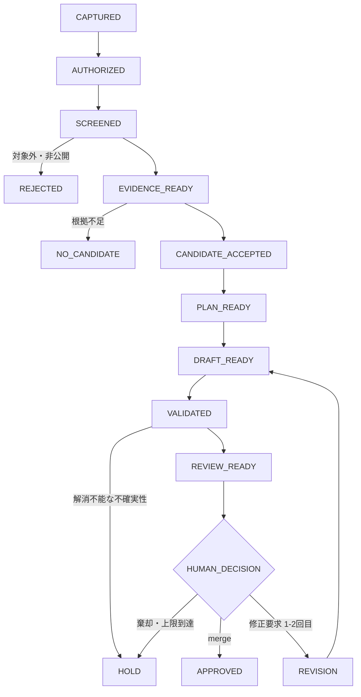

# Knowledge Harness Pipeline

## 目的

記事候補の受付から公開判断までを、再開可能で監査可能な小さなOperationへ分解する。通常経路では、人間への質問なしに公開候補の作成または安全な終了まで進める。

この文書は実装仕様ではなく、Operation間の契約を定める。ファイル形式、CLI、GitHub Actionsなどの実装詳細は、各Operationを実装するときに決める。

## 設計原則

- 一つのOperationは、一つの主目的と一つの状態遷移だけを持つ
- 同じ入力に対して同じ結果を返せる処理はProgramへ割り当て、冪等にする
- 手順と評価基準を固定できる文章処理はSkill / Agentへ割り当てる
- 規則だけでは判定できない意味判断はAI Judgeへ割り当て、根拠と確信度を残す
- 根拠不足、新規性不足、品質不足は人間への質問ではなく、安全な非公開終了を既定とする
- 人間は公開可能性、恒久方針の変更、例外、最終公開承認だけを判断する
- 人間が応答しなくても、公開以外の許可済み処理は継続できるようにする

## 状態遷移

`REJECTED`、`NO_CANDIDATE`、`HOLD`は、いずれも記事を公開しない正常終了である。`APPROVED`だけが公開を許可する。

## 共通Operation契約

すべてのOperationは、最低限次の情報を受け渡す。

- `run_id`: 一連の処理を識別するID
- `input_refs`: 入力成果物と出典への参照
- `state_before`: 実行前の状態
- `state_after`: 実行後の状態
- `result`: `ADVANCE`、`NO_CANDIDATE`、`REJECTED`、`HOLD`、`RETRYABLE_ERROR`のいずれか
- `reason_codes`: 機械判定可能な理由コード
- `summary_ja`: 運用者が読める日本語の要約
- `uncertainties`: 未確認事項と記事への影響
- `created_at`: 情報基準時刻
- `producer`: Program、Skill / Agent、AI Judge、人間の区別

入力を変更しない再実行では、成果物を重複生成せず、同じ`run_id`の状態を更新する。

## Operation一覧

| ID | Operation | 主担当 | 入力 | 出力 | 人間を呼ぶ条件 |
|---|---|---|---|---|---|
| O-01 | Capture Request | Program | 公開Issueまたは許可済み入力 | Request | 公開可能性が明示されていない |
| O-02 | Authorize Run | Program | Request、実行ラベル | Authorized Request | 呼ばない。ラベルがなければ待機 |
| O-03 | Screen Safety | Program | Authorized Request | Screening Result | 私的情報か判断不能な場合だけ |
| O-04 | Collect Evidence | Program | Screening Result、対象範囲 | Evidence Set | 呼ばない。欠落・矛盾を記録し、全面的な取得不能だけHOLD |
| O-05 | Build Evidence Packet | Skill / Agent | Evidence Set | Evidence Packet | 呼ばない。不足は明示する |
| O-06 | Judge Candidate | AI Judge | Evidence Packet、過去記事 | Candidate Decision | 呼ばない。不足・新規性なしはNO_CANDIDATE |
| O-07 | Plan Article | Skill / Agent | Accepted Candidate | Article Plan | 著者固有の動機が中心主張に必須で、根拠から復元不能な場合だけ |
| O-08 | Draft Article | Skill / Agent | Article Plan、Evidence Packet | Draft | 呼ばない |
| O-09 | Validate Draft | Program + AI Judge | Draft、Evidence Packet、公開規則 | Validation Report | 新しい恒久方針が必要な場合だけ |
| O-10 | Prepare Review | Program / Agent | Validated Draft | Draft PR、Review Packet | 呼ばない |
| O-11 | Decide Publication | 人間 | Draft PR、Review Packet | merge、修正要求、棄却 | 常に一回。最終公開判断のみ |
| O-12 | Apply Feedback | Skill / Agent | 修正要求、Draft | Revised Draft | 2回を超える修正が必要な場合だけHOLD |
| O-13 | Record Outcome | Program | 終了状態、成果物 | Status、HANDOFF、Metrics | 方針変更候補だけ別途提示 |

## 各Operationの成功条件

### O-01 Capture Request

- 「知りたいこと」が一文以上ある
- 公開Issueへ置いてよい情報であることが確認されている
- Issue作成だけでは後続処理を開始しない

不足がある場合は、公開可能性だけを人間へ確認する。記事の構成や技術的結論は質問しない。

### O-02 Authorize Run

- 明示的な実行ラベルが存在する場合だけ`AUTHORIZED`へ進む
- ラベルがなければ状態を変えず、質問や催促を行わない

### O-03 Screen Safety

- 秘密情報、個人情報、会社情報、非公開会話を検出する
- 明確に対象外なら`REJECTED`で終了する
- マスクで安全に処理できる場合は、マスク後の参照だけを後段へ渡す
- 公開可否を機械的に確定できない場合だけ人間へ確認する

### O-04 Collect Evidence

- 公式・一次情報を優先し、一般Web上の説明、評価、懸念も候補に含める
- 情報源を`primary`、`secondary`、`community`、`discovery_only`へ分類し、多数意見を事実の正しさとして扱わない
- 出典URLまたはリポジトリ参照、タイトル、発行者・著者、発行日、取得時刻、対象バージョン、該当箇所、日本語要約、確からしさと理由を保存する
- 検索結果のスニペットは発見専用とし、可能な限りリンク先を取得する
- 同一出典を重複登録せず、同一ドメインへの偏りを抑える
- 初期値として、検索3ラウンド、各ラウンド4クエリ、本文取得20件、採用12件、同一ドメイン3件、処理時間15分を上限とする
- 一時的な取得失敗は1 URLにつき追加2回まで再試行する
- 核心事実は一次・公式情報2件を目標とし、世間的評価を扱う場合は独立した二次・コミュニティ情報3件を目標とする。ただし、存在しない資料を件数合わせで補わない
- 必要な論点を確認できた場合、検索結果が重複だけになった場合、または上限へ達した場合に収集を終了する
- 根拠不足、取得不能、矛盾、対象範囲の曖昧さ、古さを理由コードと不確実性として消さずに保存する
- 何らかの証拠が得られた場合は、不足や矛盾があっても`EVIDENCE_READY / ADVANCE`として後続へ渡す
- 全面的な取得不能だけを`HOLD`とし、一時的な取得失敗は`RETRYABLE_ERROR`と区別する
- 検索数、取得試行数、成功率、採用数、一次情報率、重複数、取得不能数、矛盾数、不足論点数、処理時間をMetricsとして記録する
- 初期上限は固定的な正解とせず、原則10実行分のMetricsと後続Operationで判明した根拠不足から変更候補を作る。恒久変更は自動採用しない

### O-05 Build Evidence Packet

- O-04の`EVIDENCE_READY / ADVANCE` Evidence Setだけを入力として受け付ける
- 論点単位で、事実、推測、未確認事項、世間的反応、矛盾を分離する
- Packet内の各記述へ、Evidence Setに実在する一件以上の`source_id`を付ける
- 一次情報が示す事実と、二次・コミュニティ情報が示す説明や評価を混同しない
- 取得不能、対象範囲の曖昧さ、古さ、矛盾を不確実性として引き継ぐ
- 過去記事参照がある場合は、既知事項、差分候補、再確認が必要な事項を分ける
- 過去記事参照がない場合は、差分を推測せず未確認とする
- PDFは権威として扱わず、運用者本人の疑問や判断の記録媒体として扱う
- 根拠のない補完、矛盾の黙示的な解消、記事候補の採否判断を行わない
- 根拠充足性、新規性、読者価値、新しく記事にする理由の成立可否はO-06へ委ねる

### O-06 Judge Candidate

AI Judgeは次を独立に評価し、理由と確信度を残す。

- 根拠充足性
- 過去記事からの新規性
- 外部読者が再利用できる価値
- 著者固有の問いまたは判断の存在
- 不確実性が核心主張へ与える影響

いずれかの必須条件を満たさなければ`NO_CANDIDATE`とする。記事数を増やす目的で閾値を下げない。

### O-07 Plan Article

- 中心メッセージを一文にする
- 読者、検索動機、記事構成の型、含めない内容を決める
- ログ順ではなく読者に伝わる順序へ組み替える
- 人間への質問は、回答がないと中心メッセージが成立しない場合に一回、最大3問までとする
- 回答がなくても安全に書ける場合は、不確実性を残して続行する

### O-08 Draft Article

- 日本語のreStructuredTextとして作成する
- 原文、根拠、Article Planにない事実を追加しない
- 公開日、情報基準日、対象バージョン、記事状態を区別する
- AIの担当範囲と人間の確認範囲を明示する

### O-09 Validate Draft

Programが形式、リンク、ビルド、重複、秘密情報を検査し、AI Judgeが事実性、意味の飛躍、読者価値、構成を検査する。

- 機械修正可能な問題は自動修正して再検査する
- 核心主張の根拠不足は`HOLD`にする
- 新しい恒久方針が必要な場合だけ、人間へ選択肢と影響を提示する
- 単発記事の表現調整を恒久方針の質問にしない

### O-10 Prepare Review

- Draft PRを作成する
- Review Packetに中心メッセージ、根拠、不確実性、AI担当範囲、検証結果をまとめる
- 公開候補がない場合はPRを作らず、O-13へ進む

### O-11 Decide Publication

人間は次のいずれか一つを選ぶ。

- merge: 公開を承認する
- 修正要求: 今回の記事だけに適用する具体的修正
- 棄却: 公開しない
- 方針変更候補: 今後も適用する判断として別途検討する

指定がなければコメントは今回の記事だけに適用する。人間が応答しない場合は公開せず`HOLD`とする。

### O-12 Apply Feedback

- 修正要求だけを反映し、未依頼の全面改稿を行わない
- 修正後はO-09へ戻る
- AIによる修正は2回までとし、超過時は`HOLD`にする

### O-13 Record Outcome

- 終了状態、理由コード、成果物、検証結果、次の一手を記録する
- 公開候補なしの場合は人間を呼ばない
- 反復して発生する人間判断を改善候補として集計する
- 方針変更は自動採用せず、候補として`DECISIONS.md`に提案する

## 人間判断の予算

通常の一実行で、パイプラインから人間を呼ぶ回数は最終公開判断の一回を上限とする。実行ラベルの付与は人間が開始前に与えるトリガーであり、この判断予算には含めない。次の例外は上限外だが、同じ理由で繰り返し質問しない。

| 判断 | 既定動作 | 人間へ確認する条件 |
|---|---|---|
| 実行開始 | 待機 | 人間が実行ラベルを付ける。催促しない |
| 公開可能性 | REJECTEDまたは待機 | 入力時に明示がなく、自動判定不能 |
| 根拠不足 | NO_CANDIDATEまたはHOLD | 確認しない |
| 新規性不足 | NO_CANDIDATE | 確認しない |
| 技術的不確実性 | HOLD | 人間に技術的事実を推測させない |
| 著者の動機不足 | 不確実性を明示して続行 | 中心メッセージが成立しない場合だけ一回 |
| 単発の文章修正 | AIで修正 | Draft PRへの修正要求だけを受け付ける |
| 恒久方針の変更 | 現行方針を維持 | 選択肢と影響を提示して確認 |
| 最終公開 | HOLD | 必ず人間がmergeまたは棄却を判断 |

## 代表シナリオ

### 通常公開

`CAPTURED`から`REVIEW_READY`まで人間への質問なしで進む。人間がDraft PRを一回確認してmergeし、O-13が結果を記録する。

### 公開候補なし

O-06が新規性または読者価値不足を理由に`NO_CANDIDATE`とする。PRを作らずO-13が結果を記録し、人間を呼ばない。

### 情報不足

O-04は取得できた証拠、取得不能、矛盾、不足をEvidence Setへ残す。O-05とO-06の評価後も核心主張を支えられない場合は`NO_CANDIDATE`または`HOLD`で終了する。人間へ追加調査を依頼せず、取得不能な根拠と再開条件を記録する。

### 修正上限到達

二回のAI修正後も検証を通らない場合、`HOLD`で終了する。同じ記事について追加の修正判断を人間へ求めず、問題と再開条件を記録する。

## Phase 1後の最初の実装候補

最初の実装候補はO-13 `Record Outcome`とする。理由は、他のOperationを実装する前から成功、非公開終了、失敗、再開条件を同じ形式で残せるためである。

Phase 1の完了時に、この候補を最初の一件として採用するか確認する。採用前に実装へ着手しない。
